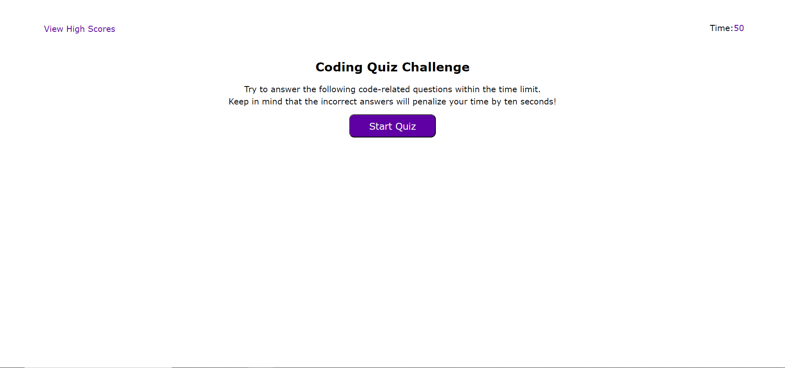

# 04 Web APIs: Code Quiz

https://tylerjohnsonhockey.github.io/04-Wild-Coding-Quiz/

This challenge was to create a coding quiz. Using DOM elements, the page changes to show questions after the user clicks the start button. Once the quiz starts a timer starts counting down from 50. when a question is answered correctly the user scores a point. If the user guesses wrong 10 seconds will be removed from the timer. The quiz is over after the timer or questions run out.

## Screenshot

